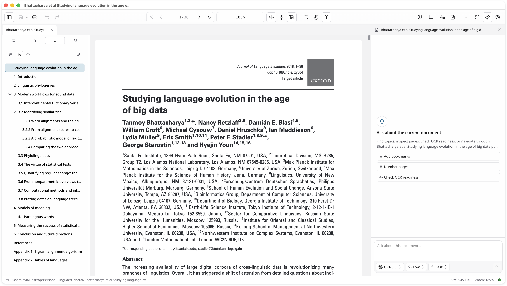

# EVB Viewer

EVB Viewer is a document workspace for PDF and DjVu files with OCR, annotations, page operations, export tools, and a multi-tab/split-view shell.

This repository contains three related apps:

| Surface | Path | Purpose |
| --- | --- | --- |
| Desktop app | repository root | Electron app plus the shared Nuxt viewer/workspace |
| Browser workspace | repository root | SSR Nuxt build served at `/` |
| Landing/download site | `landing/` | Release picker, docs, and marketing pages |



## Highlights

- Open PDFs and DjVu files, or combine PDFs and image batches into a new PDF.
- Run desktop OCR with bundled `tessdata_best` models and generate searchable PDFs.
- Annotate with free text, ink, highlight/underline/strikeout, shapes, arrows, notes, and placed images.
- Edit bookmarks/outlines, page labels, and page order from the sidebar.
- Delete, extract, insert, rotate, crop, and export selected pages.
- Export to PDF, DOCX, PNG, JPG, and multi-page TIFF.
- Work across tabs, split editor groups, and multiple windows with tab transfer/merge.
- Persist recent files, viewer defaults, theme, locale, and workspace state.

## Runtime Matrix

| Capability | Desktop (`/electron`) | Browser (`/`) |
| --- | --- | --- |
| PDF viewing/editing | Yes | Yes |
| PDF + image combine | Yes | Yes |
| DjVu viewing/conversion | Yes | Yes |
| OCR + searchable PDF | Yes | No |
| Auto-updates | Packaged macOS/Windows only | No |
| Tabs, splits, recent files | Yes | Yes |

## Supported Formats

### Open / Import

- PDF: `.pdf`
- DjVu: `.djvu`, `.djv`
- Image-to-PDF inputs: `.png`, `.jpg`, `.jpeg`, `.tif`, `.tiff`, `.bmp`, `.webp`, `.gif`
- Desktop image insertion also supports file and clipboard-based image workflows through the app menu

### Export

- PDF
- DOCX
- PNG
- JPG
- TIFF / multi-page TIFF

### OCR Languages

Bundled OCR models currently include:

- English
- French
- German
- Turkish
- Greek
- Ancient Greek
- Kurdish (Kurmanji)
- Russian
- Hebrew
- Syriac

### UI Locales

- English
- Russian
- French
- German
- Spanish
- Italian
- Portuguese
- Dutch

## Desktop Packaging

The Electron app is configured to package:

- macOS: DMG and ZIP
- Windows: NSIS installer
- Linux: AppImage and DEB

The GitHub release workflow builds:

- macOS arm64, plus a supplemental Intel ZIP lane
- Windows x64 and arm64
- Experimental Windows 7 x64 legacy artifacts in a separate best-effort lane
- Linux x64 and arm64

Desktop releases bundle native tools for OCR, image export, page operations, and DjVu handling. The packaging and verification scripts live under `scripts/`, and platform resources are assembled into `resources/`.

## Repository Layout

```text
app/        Shared Nuxt viewer UI, PDF/DjVu components, workspace shell
electron/   Electron main/preload code and native-tool-backed features
server/     SSR routes for the root web build (sitemap, robots, analytics)
landing/    Separate Nuxt landing/download/docs site
packages/   Shared contracts, i18n core/messages, release-selection logic
resources/  Bundled native binaries and OCR language data
scripts/    Build, packaging, resource-bundling, and release helpers
tests/      Unit, integration, and Electron E2E coverage
docs/       Project-specific implementation and release notes
```

## Tech Stack

- Electron 39
- Nuxt 4 + Vue 3 + TypeScript 5
- Nuxt UI 4 + Tailwind CSS 4
- PDF.js 5 for rendering
- `pdf-lib` for document rewriting and page operations
- Tesseract + Poppler + qpdf + DjVuLibre + unpaper for desktop-native workflows
- Vitest, Playwright, and Puppeteer-based Electron E2E coverage

## Getting Started

### Requirements

- Node.js latest LTS, currently `24.x`
- `pnpm` `10.x`

### Root App Setup

```bash
pnpm install
```

### Root App Commands

```bash
# Default desktop development flow (Nuxt dev server + Electron)
pnpm dev

# Web workspace only
pnpm dev:web

# Nuxt SSR web build
pnpm build

# Nuxt build + Electron bundles
pnpm build:desktop

# Run the built desktop app locally
# Best used after: pnpm build:desktop
pnpm start

# Package installers for the current host / selected target
pnpm dist
pnpm dist:mac
pnpm dist:win
pnpm dist:linux
```

### Landing Site Setup

The landing site is a separate Nuxt app with its own lockfile:

```bash
cd landing
pnpm install
pnpm dev
```

Its runtime release API uses:

- `NUXT_GITHUB_OWNER`
- `NUXT_GITHUB_REPO`
- `NUXT_GITHUB_API_BASE`
- `NUXT_GITHUB_TOKEN` (optional)

## Testing And Verification

```bash
# Static checks
pnpm lint
pnpm typecheck

# Unit + integration tests
pnpm test

# Heavy generated Electron bundle integrity check
pnpm run test:bundle-integrity

# Manual Electron E2E diagnostics
pnpm run test:e2e:electron

# Full contributor validation
pnpm validate
pnpm run test:smoke

# Native-resource sanity check
pnpm run check:resources:matrix

# Host-side release verification
pnpm run release:verify
```

Release-critical checks intentionally stop at linting, typechecking, Electron
install verification, strict artifact builds, current-platform packaging, and
the fast unit/integration suite. Broader maintenance checks stay in
`pnpm validate` and pull-request CI. Electron E2E is available as a manual
diagnostic tool when we need true desktop-shell coverage.

The manual Electron E2E smoke lane currently covers:

- Startup hydration on desktop

Set `EVB_E2E_DRAW_SHAPES_EXTENDED=1` when running the Electron E2E smoke command
to include the full draw-shape lifecycle matrix.

Broader regressions such as page operations, DOCX/image export, browser/desktop page extraction, recent-files persistence, and external-open routing are covered by fast unit/integration tests so releases do not depend on long serial UI automation.

## OCR Tuning

The desktop OCR pipeline supports two common concurrency knobs:

| Variable | Default | Description |
| --- | --- | --- |
| `OCR_CONCURRENCY` | `min(cpuCount, 8)` | Max pages processed in parallel |
| `OCR_TESSERACT_THREADS` | `floor(cpuCount / OCR_CONCURRENCY)` | Thread limit per Tesseract process |

There are also advanced queue/worker controls under `EVB_OCR_*` for release and stress scenarios.

## Architecture Notes

The root app is a shared Nuxt codebase used by both the browser workspace and the Electron shell:

- `/` is the browser workspace
- `/electron` is the desktop-only shell route
- `/workspace` is a compatibility redirect

Architecture boundaries are enforced in CI and local validation:

- `electron/**` must not import `app/**`
- `landing/**` must not import `app/**`
- `app/services/**` must not import `app/composables/**`
- cross-feature boundaries are checked by `pnpm run check:architecture`

## More Docs

- [Web build notes](docs/web-build.md)
- [Vercel deploy notes](docs/vercel-deploy.md)
- [Release process](docs/releasing.md)
- [Landing site README](landing/README.md)

## License

[MIT](LICENSE) Copyright (c) 2026 Eugene Barsky
