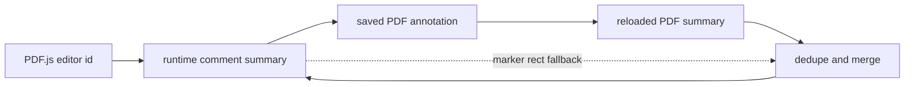

# Annotation Identity

This module owns the small, high-value identity decisions that let annotation
comments survive the trip between PDF.js editors, serialized comments, saved PDF
annotations, and reload snapshots.

## Lifecycle

## Stable-Key Precedence

Use the most durable PDF-side identity first, then fall back to runtime-only
keys:

1. `nm:<annotationName>`
2. `ann:<pageIndex>:<annotationId>`
3. `uid:<pageIndex>:<uid>`
4. `src:<source>:<pageIndex>:<id>`

`computeSummaryStableKey`, `toCanonicalStableKey`, and
`normalizeSummaryStableKey` keep that precedence aligned across summary creation,
memory-key storage, and duplicate merges.

## Helper Guide

- Stable keys and memory keys: `computeSummaryStableKey`,
  `getSummaryMemoryKeys`, `toCanonicalStableKey`, `normalizeSummaryStableKey`.
- Logical equality: `commentsShareStableIdentifier`,
  `commentsAreSameLogicalAnnotation`, `areTextMarkupCommentsLikelySame`,
  `likelyEditorPdfMirror`.
- Comment CRUD matching: `getCommentCandidateIds`, `editorIdsLikelyMatch`,
  `annotationCommentsMatch`, `selectPreferredAnnotationComment`,
  `annotationCommentEditScore`.
- Summary merge and dedupe: `mergeCommentSummaries`,
  `mergeDuplicateCommentSummary`, `dedupeAnnotationCommentSummaries`,
  `commentMergePriority`.
- Marker-rect fallback: `findEditorByMarkerRect`, `scoreMarkerRectEditor`,
  `isBetterMarkerRectMatch`, `markerRectEditorMatch`.

Prefer stable identifiers over geometry whenever both are available. Marker rects
are a fallback for editor/PDF mirrors that do not yet share a durable name, id,
or uid.
